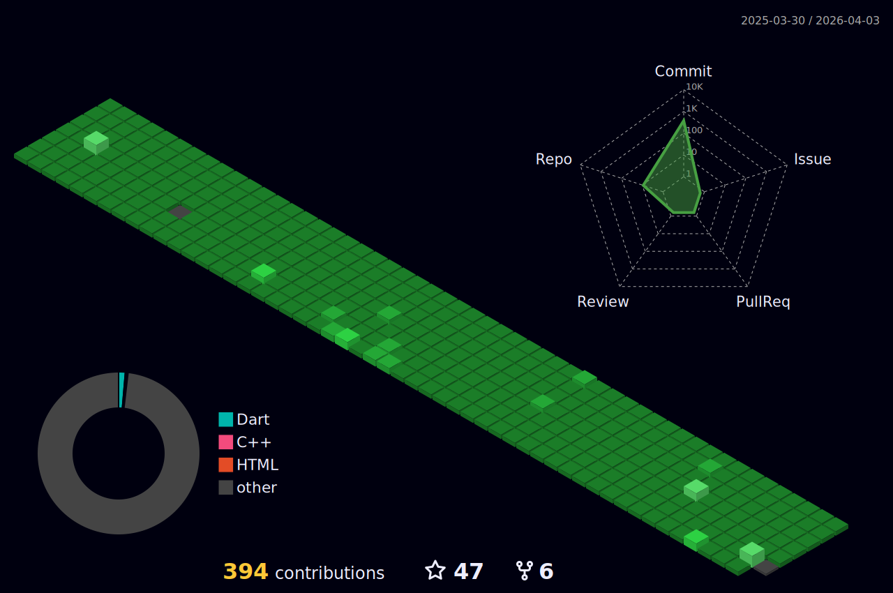

  

 
  🌎 Hello, my name's André Guerra Santos. I'm a <strong>Web/Mobile developer</strong></strong>.

  
  💌 If you want to chat with me, send me a message.

<h3 align="left">Connect with me:</h3>

<h3 align="left">Languages and Tools:</h3>

               

<kbd>***[Click here](https://github.com/AndreWar10?tab=repositories)***</kbd> *to view my projects.*  	
    

  
  

# Contributions
(in the last 365 days, languages pie based on number of commits)

 
<h3 align="center">
	⬇ Check my pinned projects below and leave a ⭐️ ⬇
</h3>
