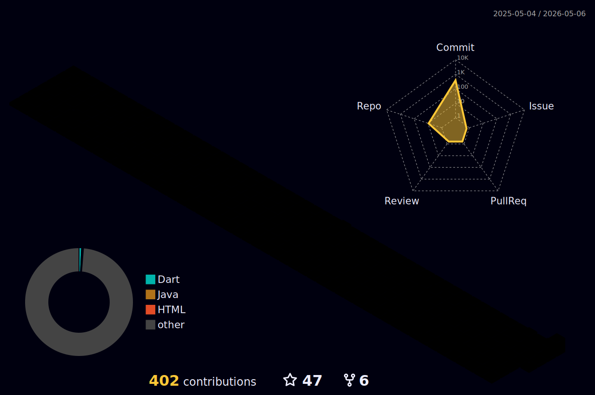

   

 
  🌎 Hello, my name's André Guerra Santos. I'm a <strong>Web/Mobile developer</strong>.

  
  💌 If you want to chat with me, send me a message.

<h3 align="left">Connect with me:</h3>
<table border="0" cellspacing="0" cellpadding="4" style="border:0;border-collapse:collapse;">
  <tr>
    <td align="center" valign="middle" style="border:0;padding:4px;"></td>
    <td align="center" valign="middle" style="border:0;padding:4px;"></td>
    <td align="center" valign="middle" style="border:0;padding:4px;"></td>
    <td align="center" valign="middle" style="border:0;padding:4px;"></td>
    <td align="center" valign="middle" style="border:0;padding:4px;"></td>
    <td align="center" valign="middle" style="border:0;padding:4px;"></td>
  </tr>
</table>

<kbd>***[Click here](https://github.com/AndreWar10?tab=repositories)***</kbd> *to view my projects.*  	

     

  

     

# Contributions
(in the last 365 days, languages pie based on number of commits)

<!--  -->

